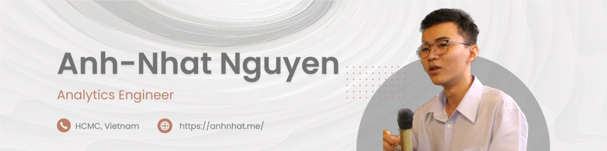

  
  

## [cite_start]👋 Hey there, I'm Anh-Nhat Nguyen! [cite: 1]

[cite_start]I'm a Data Science grad student living in Mannheim, Germany[cite: 2, 5, 6]. When I'm not studying or working on tech stuff, I like to read, listen to music, and explore nature. If you're in the Mannheim area, shoot me an email and let's meet up for coffee! ☕

### 🎓 Background & Experience
* [cite_start]**Currently:** Master of Science in Data Science Student at the University of Mannheim[cite: 4, 5]. 
* [cite_start]**Currently:** Data Scientist (Working Student) focusing on MLOps & Forecasting at SAP SE[cite: 17, 18].
* [cite_start]**Previously:** Data Engineer Team Lead for Platform & Distributed Systems at Collectius Group[cite: 25, 26].
* [cite_start]**Previously:** CRM Business Intelligence Analyst at Home Credit Vietnam [cite: 32, 33] [cite_start]and Engineering Intern at Intel Products Vietnam[cite: 37, 38].
* [cite_start]**Achievements:** Awarded the Germany Scholarship 2024 (Deutschlandstipendium) [cite: 11] [cite_start]and graduated Valedictorian (Top 1/200) for my Bachelor of Electronics Commerce at VNU UEL[cite: 12, 13].

### 💻 What I'm Currently Working On
Right now, my learning and professional development are focused on:
* [cite_start]**Agentic & LLM Systems:** Researching Multimodal LLM Agents for GUI Automation[cite: 9, 47].
* [cite_start]**MLOps & Lifecycle:** Building configuration-driven pipelines, automated evaluation frameworks, and CI/CD[cite: 21, 44].
* [cite_start]**Distributed Systems:** Engineering scalable frameworks using Azure Databricks and Apache Spark[cite: 28, 45].

### 🛠️ Technical Arsenal

| Category | Technologies |
| :--- | :--- |
| **Languages** | [cite_start]Python, SQL, PySpark, Java, Scala, C# [cite: 43] |
| **Big Data & Systems** | [cite_start]Azure Databricks, Apache Spark, Hadoop Ecosystem [cite: 45] |
| **MLOps** | [cite_start]Model DevOps, CI/CD, MLflow, GitHub Actions [cite: 21, 44] |
| **Web & Viz** | [cite_start]Flask, Streamlit, Grafana, Power BI, SAP SAC [cite: 46, 48] |

### 🌐 Connect with Me

   
  
  

---

> **Want to know more?** Check out my [Blog](https://anhnhat.me/) or read more [About Me](https://anhnhat.me/about/).
